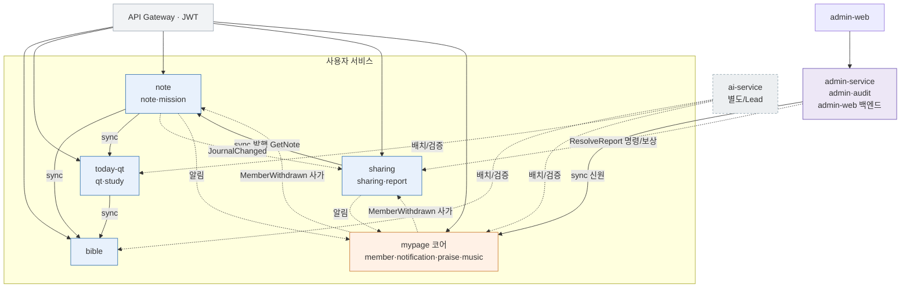

# 2026-06-08 QT-AI MSA 분리 설계안 (v2 — Saga/보상 트랜잭션 보강)

> 작성: DevD 이승욱 (Lead 강태오 계정으로 작업) · 저장소: `Tae0072/QT-AI-2nd-Team-Project`
> 상태: **초안 / 팀 검토 대기** — 거버닝 문서(07/03) 갱신 + Lead 승인 전 구현 착수 금지
> v2 변경: ① admin/audit를 **별도 admin-service**로 정정(마이페이지에서 분리) ② **분산 트랜잭션·Saga·보상 트랜잭션** 절 신설 ③ 멱등성·읽기모델·장애격리·관측성·계약테스트·보안·배포 절 추가

## 0. 배경·전제

- 현재: 단일 `qtai-server` Modular Monolith. 도메인은 `api`(UseCase+DTO)/`internal`/`client`/`web` 4레이어로 결합을 인터페이스로 최소화한 상태.
- 목표: AI 제외 **사용자 기능 5개 서비스**(오늘의 QT·성경·나눔·노트·마이페이지)로 분리. AI는 별도 `ai-service`(Lead Phase 2), 관리자 백엔드는 별도 `admin-service`.
- ⚠️ 현 CLAUDE.md는 "단일 모놀리식" + Kafka/K8s 금지. 본 설계는 그 해제를 전제 → 거버닝 문서 갱신·Lead 승인 선행 필수(미선행 시 Requirements Guard CI 차단).

## 1. 현행 결합도 (코드 실측 요약)

- 동기 호출: study→qt, qt→bible·note, note→bible, sharing→member·note, report→sharing, mission→note, member→(6개) purge, ai→(bible·qt·study·audit·member)
- 교차 FK: 대부분 사용자 데이터가 `members.id` 참조 → `memberId`가 전 서비스 공통 식별자
- 이벤트: `JournalChangedEvent`(note, **아웃박스 패턴 구현됨**), `MemberWithdrawnEvent`(member)
- 기존 비동기 토대: `JournalEventReprocessor` = PENDING 드레인 + FAILED 백오프 재시도 + 재시도 상한 + 이벤트별 독립 트랜잭션 + 수동 재큐 → **사가 인프라의 검증된 토대**
- 교차 쓰기 핵심 2곳: `MemberRetentionPurgeService`(탈퇴 6도메인 purge), `AdminReportService.process()`(report 갱신 후 `sharing.hideForModeration` 호출)

## 2. 서비스 인벤토리 (정정판)

| 서비스 | 도메인 | 성격 | 소유 테이블(주요) |
|---|---|---|---|
| **today-qt** | qt, study | 사용자 | qt_passages, verse_explanations, simulator_clips, glossary_terms |
| **bible** | bible | 사용자 | bible_books, bible_verses |
| **note** | note, mission | 사용자 | notes, note_verses, journal_events, mission_*, member_mission_progress |
| **sharing** | sharing, report | 사용자 | sharing_posts, comments, post_likes, reports |
| **mypage** | member, notification, praise, music | 사용자/계정·인증 코어 | members, member_settings, member_auth_providers, notifications, praise_*, music_tracks |
| **admin-service** | admin, audit | **관리자(별도 admin-web 백엔드)** | admin_users, admin_action_log, audit_logs |
| (제외) **ai-service** | ai | AI (Lead) | ai_generation_jobs, ai_generated_assets, ai_validation_logs |

**admin/audit 정정 사유**: admin은 `/api/v1/admin/**`를 통해 **별도 admin-web 프런트**가 호출하는 관리자 백엔드(역할검증·모더레이션·통계)이고 audit는 그 감사로그다. 사용자 마이페이지와 책임이 다르므로 mypage가 아니라 **독립 admin-service**가 맞다. `admin_users→members` FK는 끊고 admin-service가 mypage(member)를 신원 조회로 참조한다.

설계 포인트: **mission→note, report→sharing** 동거로 최핫 동기호출 2개를 서비스 내부화. 특히 report를 sharing에 두면 "신고 처리 + 게시물 숨김"이 sharing **로컬 트랜잭션 1건**으로 끝나 분산 트랜잭션 면적이 줄어든다(§6.3 W2).

## 3. 통신 모델

**동기(REST — 기존 `client/*UseCase` 어댑터를 HTTP로 교체, 인터페이스 불변)**: 실시간 일관성 필수 경로만 — today-qt/note→bible(본문·절), note→today-qt(passage 참조), sharing→note(발행 시 GetNote 1회), admin-service→mypage(신원). 나눔은 **스냅샷 저장**이라 발행 후 호출 불필요.

**비동기(아웃박스→Kafka)**: 탈퇴 purge 사가, `JournalChangedEvent`, 알림 발송, 모더레이션 명령. §6 참조.

**게이트웨이/인증**: API Gateway(Spring Cloud Gateway) 라우팅 + JWT 1차 검증, 각 서비스 JWKS 공개키 검증, `memberId` 클레임이 공통 신원. mypage=토큰 발급자.

**공유 코드**: `qtai-common` 모듈(ApiResponse/ErrorCode/BusinessException/BaseEntity/JWT 검증/이벤트 봉투)로 추출해 각 서비스가 버전 의존.

## 4. 데이터·경계 전략 (확정 2026-06-08)

팀 확정 원칙(7) + 보강(5):

1. **저장소**: monorepo Gradle 멀티모듈(A안). `lib-common` + `service-*` (각 독립 부팅 앱).
2. **서비스 자율 구성**: 각 `service-*`는 자기 `application.yml`·자기 port·자기 datasource 보유.
3. **DB는 우선 스키마만 분리**(같은 인스턴스). → 보강: 서비스별 **DB 유저 분리 + 자기 스키마 권한만** 부여해 교차 스키마 접근을 DB 레벨에서 차단. Flyway도 서비스별(분리된 `schema_history`·locations).
4. **서비스 간 FK 제거**: `member_id`/`note_id`/`qt_passage_id`/`verse_id`를 plain reference로 강등. → 보강: 마이그레이션으로 FK DROP(스키마 이동 전), 무결성은 앱 보장 + **고아 레코드 정리 배치**.
5. **서비스 간 직접 Repository 호출 금지**. → 보강: **ArchUnit/Spring Modulith 규칙으로 기계 강제**(모듈 A가 B의 `internal` import 금지, 오직 `lib-common` 계약/HTTP 클라이언트). 기존 `api/UseCase` 인터페이스를 **그대로 HTTP 클라이언트 계약**으로 재사용.
6. **필요 데이터는 API 또는 이벤트로 연결**. → 보강: 같은 인스턴스라도 **교차 스키마 트랜잭션 금지**. 두 서비스 쓰기는 schema-split 단계에서도 §5 사가/아웃박스 적용.
7. **안정화 후 물리 DB 분리**: 서비스별 DB 인스턴스 이전. 컷오버는 dual-write 또는 read-from-old→backfill→cutover.

- **폴리모픽 참조**(`reports.target_type/target_id`): 경계 넘는 FK 불가 → 신고 생성 시 대상 메타 **스냅샷**을 sharing(report)에 비정규화.
- **운영(Strangler)**: 게이트웨이가 경로별 라우팅 → 추출 서비스는 모놀리식과 **병행 기동 후 컷오버**. 기존 `*UseCaseMock`은 로컬/dev 폴백으로 재활용.

### 4.1 Phase 0 첫 증분 (착수)
브랜치 `feature/msa-foundation`(dev 기준). 코드 동작 무변경, 구조만 도입:
1. `qtai-server`를 Gradle 멀티모듈로 전환(기존 코드는 `app` 모듈로 유지).
2. `lib-common` 모듈 신설 → 의존 없는 공유 클래스(ApiResponse·ErrorCode·BusinessException·BaseEntity)부터 이전, `app`이 의존.
3. `./gradlew build` 통과 확인. (JWT 검증 등 Spring 의존 공유 코드·Gateway·docker-compose 스키마/유저는 후속 증분.)

## 5. (핵심) 분산 트랜잭션 · Saga · 보상 트랜잭션

### 5.1 원칙
- **로컬 트랜잭션 우선**: 한 서비스 DB 안에서 끝나도록 경계를 그린다(report+sharing 동거가 그 예).
- **교차 쓰기는 Saga**: 2PC(분산 2단계 커밋) 미사용. 각 단계는 자기 로컬 트랜잭션 + 이벤트/명령으로 연결, 실패 시 **보상(semantic rollback)**.
- **표현 규칙 준수**: "정확히 1회/유실 0%"가 아니라 **재처리 가능 + 실패 로그 보존**(팀 규칙). at-least-once 전달 + 멱등 소비 = 효과상 1회.

### 5.2 인프라 토대 (기존 자산 확장)
- **트랜잭셔널 아웃박스**: 도메인 변경과 이벤트 적재를 같은 로컬 트랜잭션에 기록(이미 `JournalEventOutbox`). 릴레이가 Kafka로 발행.
- **재처리기**: `JournalEventReprocessor` 패턴 재사용 — PENDING 드레인, FAILED 지수 백오프 재시도, 재시도 상한 도달 시 상태·원인·retryCount 보존(수동 재큐), 이벤트별 독립 트랜잭션 격리.
- **멱등 소비**: 모든 이벤트에 `eventId`, 명령에 `idempotency-key`. 소비자는 `processed_events`(서비스별) 테이블로 중복 무시.
- **이벤트 봉투 표준**: `eventId, type, occurredAt, traceId, payload, schemaVersion`.

### 5.3 워크플로별 설계 (정상 / 실패 / 보상)

**W1. 회원 탈퇴 → 다서비스 purge (choreography saga, 보상 불필요형)**
- 정상: mypage가 member를 `WITHDRAWN`으로 마킹(로컬) → `MemberWithdrawnEvent` 아웃박스 발행. note·sharing·(mypage 내부 praise/notification)·admin(audit 보존 정책)이 각자 자기 데이터 purge 후 `MemberDataPurged{service}` 발행. mypage의 **purge-tracker**가 기대 서비스 ack를 모두 수신하면 member 행 **최종 하드 삭제**.
- 실패: 특정 서비스 purge 실패 → 재시도(백오프)·DLQ. 미완료면 member는 `WITHDRAWN/purge-pending` 유지(고아·조기삭제 없음).
- **보상이 불필요한 이유**: 삭제는 **멱등**(재실행 안전)하고, 최종 하드 삭제가 모든 ack에 **gated** 되어 부분 성공이 위험 상태를 만들지 않음. → "retry-until-success" 사가.

**W2. 신고 처리/모더레이션 (admin-service → sharing, 보상 필요)**
- 현재(모놀리식): `AdminReportService.process()`가 report 갱신 후 같은 흐름에서 `sharing.hideForModeration` 호출.
- 분리 후 권장: report를 **sharing-service에 동거** → admin-service는 `ResolveReport{reportId, action=HIDE, adminId, idemKey}` **명령**만 전송. sharing-service가 **로컬 트랜잭션 1건**으로 report=RESOLVED + post=HIDDEN 원자 처리 후 `ReportResolved` ack. (교차 쓰기 → 단일 명령으로 축소)
- 실패/보상: sharing-service가 일시 실패 → admin은 명령 재시도(멱등). 영구 거부(이미 삭제된 post 등) → sharing이 `ReportRejected(reason)` 반환 → admin은 report를 `PENDING` 복귀(=**보상**) + 운영 알림. admin 측이 먼저 "처리중"으로 표기했다면 ack 전까지 `PENDING_ACTION` 상태로 두어 UI 오표시 방지.

**W3. 노트 발행 → 나눔 (sync-read + 로컬 쓰기, 조건부 보상)**
- 기본: sharing.publish가 note-service에서 GetNote(sync) + 중복검사(sharing 로컬) 후 **스냅샷 저장**. note에 쓰기 없음 → 분산 트랜잭션 아님.
- 만약 note에 `shared=true` 마킹을 추가한다면 saga화: ① sharing이 post `PENDING` 생성 → ② note.markShared 명령 → ③a 성공=post `ACTIVE`, ③b 실패=**보상: post void/삭제** + 사용자에 실패 응답. (가능하면 마킹을 이벤트로 빼서 동기 결합 회피)
- 역방향: 노트 삭제 → `JournalChangedEvent` → sharing `MarkSourceNoteDeleted`(멱등 플래그 `sourceNoteUnsharedAt`, 이미 구현). 보상 불요.

**W4. 알림 fan-in (best-effort, 보상 불필요)**
- 각 서비스가 `NotificationRequested` 이벤트 발행 → mypage(notification)가 멱등 생성. 실패 시 재시도/DLQ. 사용자 알림은 보상 대상 아님.

### 5.4 보상 트랜잭션 일반 규칙
- 보상은 **의미적 롤백**(역연산)이지 물리적 undo가 아니다(예: report→PENDING 복귀, post void).
- 모든 보상도 **멱등** + `idempotency-key` 기반(중복 보상 무해).
- 각 사가 단계에 **타임아웃 + 최대 재시도 + DLQ**. 상한 초과 시 자동 중단·상태 보존·운영 알림(수동 개입).
- 사가 상태 추적: 오케스트레이션형은 saga-state 테이블, 코레오그래피형은 서비스별 상태 + 코디네이터(purge-tracker). 본 설계는 대부분 **코레오그래피**(결합 최소), 모더레이션만 admin이 가벼운 오케스트레이션.

## 6. 일관성 · 읽기 모델
- 기본 **결과적 일관성(eventual)**. 사용자 쓰기 직후 화면은 자기 서비스 로컬 결과로 즉시 반영, 타 서비스 반영은 이벤트 전파 후.
- 교차 서비스 조회(예: 마이페이지 대시보드 = member + mission + notification): 1차로 **API composition**(mypage가 note-svc 미션 요약 + 자기 알림 조합). 지연이 문제면 **CQRS read model**(mypage가 미션 요약 이벤트를 구독해 읽기 전용 사본 유지)로 승급.
- 나눔 피드는 이미 **스냅샷**이라 조인 없이 단독 조회 가능.

## 7. 장애 격리 · 관측성
- **격리**: 동기 호출에 timeout + 서킷브레이커(Resilience4j) + 폴백. 기존 `*UseCaseMock` 어댑터를 **graceful degradation 폴백**으로 재활용 가능.
- **관측성**: 게이트웨이에서 `traceId`(W3C traceparent) 생성·전파, 이벤트 봉투/로그에 포함. 중앙 로깅/트레이싱(예: OpenTelemetry).
- **실패 로그 규칙 매핑**: 기존 "event handler 실패 로그(eventId, type, handler, error)" 규칙을 소비자 DLQ 로깅으로 그대로 적용.

## 8. 서비스 간 보안
- 내부 호출 인증: 서비스 토큰 또는 mTLS(내부망). 사용자 컨텍스트는 JWT 전파(`memberId`).
- 배치/이벤트 작업은 사용자 계정이 아니라 `SYSTEM_BATCH` 주체로 기록(기존 규칙).
- 관리자 경로는 토큰 `role=ADMIN` + admin-service `admin_users.admin_role` 이중 확인(분리 후 admin-service 내부에서 검증).

## 9. 계약 테스트 · 배포 · 레포 전략
- **계약 테스트**: UseCase가 HTTP/이벤트 계약이 되므로 소비자 주도 계약(Spring Cloud Contract / Pact)으로 서비스 간 호환 보장.
- **레포**: monorepo(서비스별 Gradle 모듈) 우선 권장 — 공유 `qtai-common` 버전 관리·원자적 리팩터링 용이. 추후 polyrepo 전환 가능.
- **CI/CD**: 서비스별 빌드·테스트·이미지·배포 파이프라인 분리. Flyway 서비스별 분할. 기존 품질 게이트(ArchUnit→서비스 내부 경계, gitleaks, spectral)는 서비스별로 유지.

## 10. 마이그레이션 로드맵 (Strangler — 리프부터)

| 단계 | 추출 | 의존 | 난이도 | 메모 |
|---|---|---|---|---|
| 0 | 공통 인프라 | — | ★★ | qtai-common, Gateway, JWKS, 아웃박스→Kafka, processed_events |
| 1 | **bible** | 없음 | ★ | 패턴 검증 |
| 2 | **today-qt** | bible | ★★ | study 흡수 |
| 3 | **note** | bible, today-qt | ★★★ | mission 흡수, 아웃박스 이전 |
| 4 | **sharing** | note, mypage | ★★★ | report 흡수, 모더레이션 명령(W2) |
| 5 | **admin-service** | mypage, sharing | ★★★ | admin-web 백엔드 분리, 모더레이션 오케스트레이션 |
| 6 | **mypage(코어)** | — | ★★★★ | member 허브·인증·purge 사가가 잔여로 남음 |

각 단계: 스키마/FK 정리 → `client` 어댑터를 HTTP/이벤트로 교체 → 게이트웨이 라우트 → strangler 병행 검증 → 모놀리식에서 제거. ai-service는 병렬(Lead).

## 11. 리스크 / 선결 과제
- **거버넌스(최우선)**: CLAUDE.md(단일 모놀리식·Kafka/K8s 금지) 충돌 → 07/03 갱신 + Lead 승인. Lead 로드맵(Kafka Phase 3)과 부합.
- **팀 범위**: member·bible·qt·study·admin은 타 담당 도메인 → 팀 아키텍처 결정. 이승욱 단독 PoC 가능 범위는 note·sharing.
- **운영 복잡도 급증**: 게이트웨이·디스커버리·분산 트레이싱·서비스별 CI/CD·DLQ 운영.
- **데이터 정합성**: FK 제거 후 앱 레벨 무결성 + 고아 정리 배치.
- **사가 복잡도**: 보상·타임아웃·멱등·DLQ 테스트 비용. 계약 테스트 필수.

## 12. 서비스 간 내부 endpoint 계약 (AI ↔ 제공 서비스)

> 추가 사유(2026-06-08): ai-service 분리 작업자가 "분리 시 서비스별 호출 endpoint가 필요하다"고 요청. AI가 호출하는 6개 계약을 여기서 고정한다. 본 절은 **계약(인터페이스) 확정**이며, 실제 HTTP endpoint 개설 시점은 §10 로드맵의 제공 서비스 추출 단계다(Q1 결정).

### 12.0 4개 확인 질문 결정 (2026-06-08, DevD/T)

| # | 질문 | 결정 | 근거 |
|---|---|---|---|
| Q1 | endpoint 개설 시점 | **서비스 분리 후 개설**. 그 전까지 AI는 `ai/client/*Client`(현 `*Mock`)로 in-process 호출 유지. 계약(인터페이스)은 지금 확정하므로 Mock→HTTP 어댑터 교체만으로 전환 | §3·§10 Strangler. 인터페이스 불변 = 무중단 컷오버 |
| Q2 | 경로 prefix | **`/api/v1/system/**`** | 이미 `SystemAi*Controller`가 사용 중인 기존 컨벤션. 신규 prefix 없이 SecurityConfig·`SYSTEM_BATCH` 체계와 정렬 |
| Q3 | 인증 방식 | **서비스 토큰(Bearer) + `SYSTEM_BATCH` 권한**. MSA에서는 발급자(mypage) JWKS 공개키로 각 서비스가 검증. 사용자 맥락 필요 시 사용자 JWT의 `memberId` 클레임 전파. 내부망 mTLS는 §8 네트워크 강화로 후속 | 기존 `SystemAiAuthentication.requireSystemBatch` 그대로 재사용. CLAUDE.md §5 SYSTEM_BATCH 주체 규칙 |
| Q4 | 응답 envelope | **기존 `ApiResponse<T>` 그대로 통일**: `{success, data, error{code,message}, timestamp, traceId}` | `com.qtai.common.dto.ApiResponse` 이미 존재. `lib-common`으로 추출해 전 서비스 공유(§3) |

### 12.1 공통 규약 (전 endpoint)

- **Base prefix**: `/api/v1/system/...` · 인증: `Authorization: Bearer {service-token}` → `SYSTEM_BATCH` 권한 필수(미보유 시 401/403).
- **멱등성**: 쓰기(publish/hide/audit) 계열은 `Idempotency-Key` 헤더 필수, 소비자는 `processed_events`/키 테이블로 중복 무시(§5.2).
- **관측성**: `traceparent`(W3C) 전파, 응답 `traceId`에 반영.
- **OpenAPI**: 내부 system endpoint는 사용자/관리자 OpenAPI 문서에 **비노출**(CLAUDE.md §5). 계약 검증은 소비자 주도 계약 테스트(Pact/Spring Cloud Contract, §9)로.
- **에러**: 도메인 예외는 `ApiResponse.error(code,message)`로 감싸고, AI 측은 `AiClientException`으로 변환(기존 어댑터 규약 유지).
- **금지 데이터 가드**: Bible 응답은 한글성경(`88.json`)·KJV만. 개역개정/ESV/NIV 본문 및 성서유니온·두란노 텍스트는 seed/응답 어디에도 포함 금지(CLAUDE.md §8). 검증용 한국어 주석 원문은 사용자 노출 경로가 아니므로 본 system 계약과 분리.

### 12.2 endpoint 계약 6종

각 계약은 **기존 `ai/client/*` 인터페이스를 HTTP로 그대로 승격**한 것이다(필드명 일치 확인 완료). "라이브 단계"는 §10 로드맵에서 endpoint가 실제 켜지는 시점.

**① QT context 조회** — 제공: today-qt · 매핑: `QtContextClient` / `qt.GetQtPassageContentContextUseCase` · 라이브: 2단계
- `GET /api/v1/system/qt/passages/{passageId}/context`
- 응답(`QtContextResult`): `passageId, bibleBook, chapter, startVerse, endVerse, passageReference, title, summary, passageContext`
- ⚠️ 미결: `cacheStatus` 포함 여부 — context 조회는 생성·검증용이라 사용자 노출 캐시 상태와 무관. **②에만 두고 ①에서는 제외 권장**. `passageContext` 필드 정의 미확정(아래 12.3).

**② 오늘 QT passage 상태 조회** — 제공: today-qt · 매핑: `qt.GetTodayQtUseCase`(상태 부분) · 라이브: 2단계
- `GET /api/v1/system/qt/passages/today/status` (옵션 `?date=YYYY-MM-DD`)
- 응답: `qtDate, exists, passageId(nullable), cacheStatus`
- `cacheStatus` enum: `HIT | MISS | STALE_FALLBACK | EMPTY`. 00:00~04:00 KST 폴백 구간은 `STALE_FALLBACK`, passage 없음은 `EMPTY`(CLAUDE.md §6).

**③ Bible verse 조회** — 제공: bible · 매핑: `BibleVerseClient` / `bible.GetBibleVerseUseCase` · 라이브: 1단계
- 단건: `GET /api/v1/system/bible/verses/{verseId}`
- 목록: `POST /api/v1/system/bible/verses:batch` body `{ "verseIds": [..] }` (id 다수 → URL 길이 회피 위해 POST)
- 범위: `GET /api/v1/system/bible/verses?book={book}&chapter={c}&startVerse={s}&endVerse={e}`
- 응답(`BibleVerseResult`): `verseId, bibleBook, chapter, verse, reference, koreanText, englishText` (범위는 `BibleVerseRangeResult`로 래핑)
- 🔒 12.1 금지 데이터 가드 적용.

**④ Study publish / hide** — 제공: today-qt(study) · 매핑: `StudyPublishClient` / `study.PublishApprovedVerseExplanationUseCase`·`HidePublishedVerseExplanationUseCase` · 라이브: 2단계
- publish: `POST /api/v1/system/study/verse-explanations:publish` · `Idempotency-Key` 필수
  - body(`PublishVerseExplanationCommand`): `bibleVerseId, summary, explanation, sourceLabel, aiAssetId, approvedAt`
- hide: `POST /api/v1/system/study/verse-explanations:hide` · body(`HideVerseExplanationCommand`): `aiAssetId`
- 승인본만 `verse_explanations` read model에 반영(CLAUDE.md §6·§7). 검증 전 원문 노출 금지.

**⑤ Audit log 기록** — 제공: admin-service(audit) · 매핑: `AuditLogClient` / `audit.WriteAuditLogUseCase` · 라이브: 5단계
- `POST /api/v1/system/audit/logs` · `Idempotency-Key` 필수
- body(`AuditLogCommand`): `adminUserId, actorType, actorId, actorLabel, actionType, targetType, targetId, beforeJson, afterJson`
- 배치/AI 주체 작업은 `actorType=SYSTEM_BATCH`로 기록(사용자 계정 아님).

**⑥ Admin/Auth 권한 검증** — 제공: admin-service · 매핑: `AdminAuthClient` / `admin.VerifyAdminRoleUseCase` · 라이브: 5단계
- active admin: `GET /api/v1/system/admin/auth/active?memberId={id}`
- 단일 role: `GET /api/v1/system/admin/auth/verify?memberId={id}&role={ROLE}`
- 복수 role(하나 충족): `GET /api/v1/system/admin/auth/verify-any?memberId={id}&roles=ROLE_A,ROLE_B`
- 응답(`AdminAuthResult`): `adminUserId, memberId, adminRole`
- role enum: `OPERATOR | REVIEWER | CONTENT_CREATOR | SUPER_ADMIN`. CLAUDE.md §5 — 회원 토큰 `members.role=ADMIN` + `admin_users.admin_role` 이중 확인.

### 12.3 미결 / 후속 (작업자 합의 필요)

- **QtContextClient 스텁 미완성**: `ai/client/qt/QtContextClient.java`·`dto/QtContextResult.java`가 현재 저장소에서 잘려 있음(`public interface QtContex`, record 마지막 필드 미완). ①·② 계약 확정과 함께 인터페이스부터 마감 필요.
- **`passageContext` 정의**: ① 응답의 `passageContext` 문자열이 무엇을 담는지(요약 메타 vs 본문 컨텍스트 블록) 미확정. AI 생성/검증에 실제 필요한 필드 셋을 AI 작업자와 확정.
- **①의 `cacheStatus`**: 위 권장대로 ①에서 제외할지 확정.
- **계약 테스트 시점**: bible(1단계)·today-qt(2단계)·admin-service(5단계) 추출 PR에 각 system endpoint의 Pact 소비자 계약 포함.

---

## 13. 다음 액션
1. 본 설계안 Lead/팀 리뷰 → 거버닝 문서 갱신 여부 결정.
2. 0단계(공통 인프라) + 1단계(bible) PoC.
3. note·sharing(본인 범위) 우선 사가 PoC: 모더레이션(W2)·발행(W3)·탈퇴 purge(W1) 시나리오 계약·보상 테스트.

## 부록: 서비스 의존도 다이어그램 (Mermaid)

실선=동기(REST), 점선=비동기(이벤트/사가). admin-service는 별도 admin-web 프런트의 백엔드다.
