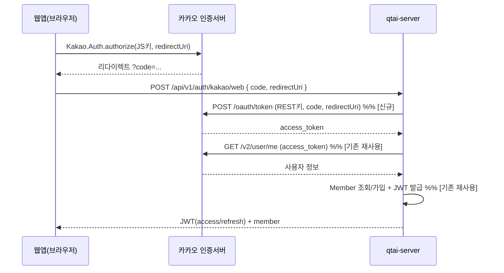

# [검토 요청] 웹 카카오 로그인 — 서버측 OAuth(code→token) 설계안

> **작성일:** 2026-06-07
> **상태:** 설계안(구현 전) · **검토 대상:** Lead(강태오) + 강사
> **결론 먼저:** 이 설계는 **2026-05-19 강사 직강 결정("서버사이드 OAuth 미사용, 클라이언트가 토큰을 받아 전달")을 변경**해야만 가능하다. 즉 단순 기능 추가가 아니라 **아키텍처/요구사항 변경**이며, 강사·Lead 승인 전에는 구현하지 않는다.

---

## 1. 왜 이 문서가 필요한가

브라우저(웹)에서 카카오 로그인을 하려면 **반드시 서버가 OAuth 인가코드를 토큰으로 교환**해야 한다. 이유:

- 이 앱이 쓰는 `kakao_flutter_sdk_user`는 **Android/iOS 전용**(pub.dev 지원 플랫폼에 web 없음).
- 웹은 카카오 **JavaScript SDK v2**를 써야 하는데, v2는 **브라우저에서 토큰을 바로 주지 않는다**(v1 팝업 토큰 로그인 폐지). `Kakao.Auth.authorize()`로 **인가코드(code)만** 받는다.
- 그 코드를 **액세스 토큰으로 교환하려면 REST API 키로 토큰 API를 호출**해야 하고, 이는 키 노출·CORS 때문에 **브라우저가 아니라 서버**에서 해야 한다.

→ 따라서 "서버 변경 없는 웹 카카오 로그인"은 존재하지 않는다. 서버측 code→token 교환이 **필수**다.

## 2. 문서화된 결정과의 충돌 (가장 중요)

`CLAUDE.md` / `03_아키텍처_정의서.md`(§4.9·§13.6)에 명시:

> "Flutter SDK가 카카오 토큰을 직접 받아 `POST /api/v1/auth/kakao`로 서버에 전달한다. **서버사이드 `/oauth2/**` 경로는 사용하지 않는다.**" (2026-05-19 강사 직강)

본 설계는 서버가 OAuth code→token 교환을 수행하므로 위 결정의 **취지를 바꾼다**. 신규 경로가 문자 그대로 `/oauth2/**`는 아니지만(아래는 `/api/v1/auth/kakao/web` 제안), "서버가 OAuth를 직접 처리"한다는 점에서 동일한 성격이다. **규칙(`07→03→04…` 충돌 시 임의 변경 금지)에 따라 강사·Lead 승인 및 문서(03/04/07) 갱신이 선행되어야 한다.**

## 3. 현재 구조 (코드 근거)

| 요소 | 위치 | 역할 |
| --- | --- | --- |
| 엔드포인트 | `member/web/AuthController.java` `POST /api/v1/auth/kakao` (permitAll, F-01) | 로그인 진입 |
| 요청 DTO | `member/api/dto/LoginRequest.java` = `{ kakaoAccessToken }` | 토큰 1개 |
| UseCase | `member/api/LoginUseCase.java` → `AuthService.login()` | 로그인 처리 |
| 카카오 클라이언트 | `member/client/kakao/KakaoOAuthClient.java` | **`getUserInfo(token)`만** 존재(토큰 교환 없음) |
| 설정 | `application.yml` `kakao.api.user-info-url=https://kapi.kakao.com/v2/user/me` | 사용자조회 URL |

현재 `AuthService.login()` 후속 로직(사용자정보 → Member 조회/자동가입 → 탈퇴 재활성화 → JWT access/refresh 발급 → Redis 저장)은 **플랫폼과 무관하게 동일**하다. 즉 웹에서 새로 필요한 건 **앞단의 "code→token" 한 단계뿐**이고 나머지는 그대로 재사용한다.

## 4. 제안 설계

### 4.1 흐름

### 4.2 변경 목록 (member 도메인 내부, 경계 위반 없음)

1. **신규 엔드포인트** `POST /api/v1/auth/kakao/web` (permitAll) — `AuthController`에 메서드 추가. 기존 `/auth/kakao`(모바일)는 **불변**.
2. **신규 요청 DTO** `KakaoWebLoginRequest { String authorizationCode; String redirectUri; }` (`member/api/dto`). 응답은 기존 `LoginResponse` 재사용.
3. **`KakaoOAuthClient`에 토큰 교환 메서드 추가** — `exchangeCodeForToken(code, redirectUri)` → `POST https://kauth.kakao.com/oauth/token` (grant_type=authorization_code, client_id=REST키, client_secret(옵션), redirect_uri, code) → `access_token` 반환. 기존 `client/kakao/` 패키지에 그대로 들어가 도메인 경계 영향 없음.
4. **`AuthService` 공통 로직 추출** — 현재 `login()`의 "KakaoUserInfo → Member → JWT" 부분을 private 공통 메서드로 분리. 기존 `login(token)`과 신규 `loginWithKakaoCode(code, redirectUri)`가 함께 사용. (행동 변화 없는 순수 리팩터링)
5. **`LoginUseCase`(또는 신규 `KakaoWebLoginUseCase`)에 메서드 추가** — 포트 확장.
6. **설정 추가** — `kakao.oauth.token-url`, `kakao.oauth.rest-api-key`(비밀), `kakao.oauth.client-secret`(옵션·비밀), `kakao.oauth.allowed-redirect-uris`(화이트리스트).
7. **SecurityConfig** — `/api/v1/auth/kakao/web` permitAll 추가(기존 `/auth/**` 패턴에 포함되면 변경 불필요).

### 4.3 설정·보안

- **비밀값 주입**: REST 키/시크릿은 `${KAKAO_REST_API_KEY}`처럼 환경변수로만 주입(기존 JWT 키와 동일 패턴, `.env`/`env_file`). 레포 평문 금지(CLAUDE.md §8, gitleaks). 로그에 키·코드·토큰 미노출(§9).
- **redirect_uri 화이트리스트**: 클라이언트가 보낸 `redirectUri`를 서버가 **허용 목록과 대조**해 검증(오용·코드 가로채기 방지). dev는 `http://localhost:3000`, prod는 실제 도메인.
- **CORS**: 웹 출처(`http://localhost:3000` 등)가 이미 `cors.allowed-origins`에 있어야 함(웹 지원 작업과 동일).

## 5. 영향도

- **모바일 경로 불변**: `/auth/kakao`(토큰 기반)와 기존 테스트는 그대로. 회귀 위험 낮음.
- **도메인 경계**: 전부 `member` 도메인 내부(web→api→internal→client/kakao). 타 도메인 import·HTTP 우회 없음 → ArchUnit/Modulith 경계 영향 없음.
- **문서 갱신 필요(승인 시)**: `03_아키텍처_정의서`(OAuth 결정), `04_API_명세서`(신규 엔드포인트+openapi.yaml), `07_요구사항_정의서`(웹 로그인 범위), F-01에 웹 변형 명시.
- **DB**: 스키마 변경 없음(기존 `members`/`member_auth_providers` 재사용).

## 6. 테스트 계획

- `KakaoOAuthClientTest`: 토큰 교환 성공/실패(4xx, 타임아웃) — RestTemplate mock.
- `AuthServiceTest`: `loginWithKakaoCode` 신규/기존 회원·탈퇴 재활성화 경로가 토큰 기반과 동일 결과인지.
- `AuthControllerTest`: `/auth/kakao/web` 200/검증오류(400)/카카오실패(401), redirect_uri 화이트리스트 위반 차단.
- 보안: 허용되지 않은 redirect_uri, 빈 code 차단.
- 게이트: `./gradlew -p qtai-server build test jacoco...`, spectral(openapi), gitleaks.

## 7. 대안 비교

| 대안 | 서버 변경 | 가능 여부 | 비고 |
| --- | --- | --- | --- |
| 클라이언트 단독(브라우저가 토큰 교환) | 없음 | **불가** | 카카오 토큰 엔드포인트 CORS 미지원 + REST키 노출 |
| **(본안) 서버측 code→token 교환** | 있음(엔드포인트 1개+클라 1개 메서드) | 가능 | 강사 결정 변경 필요 |
| 보류(웹 로그인 안 함) | 없음 | — | 로그인은 기기/에뮬레이터, 웹은 UI·API·TTS 확인용 |

## 8. 리스크 · 미해결 질문

- **강사 승인**: OAuth 결정 변경이라 강사 확인이 우선. 승인 없으면 본 설계는 보류.
- **카카오 콘솔 설정**: [내 앱 > 카카오 로그인 > Redirect URI]에 `http://localhost:3000`(dev)·prod 도메인 등록, [보안]에서 client_secret 사용 여부 결정, [플랫폼 > Web] 사이트 도메인 등록.
- **키 관리**: REST 키/시크릿을 어디서 주입할지(.env / 배포 시크릿).
- **prod 도메인**: 웹을 실제 배포할지(현재 제품은 Flutter 앱 중심) — 배포 안 하면 우선순위 낮음.

## 9. 권고 · 다음 단계

1. **먼저 강사·Lead 결정**: "웹 카카오 로그인을 위해 서버측 OAuth code 교환을 허용할지". 보류면 여기서 종료(웹은 UI·API·TTS 확인용).
2. 승인 시 문서(03/04/07) 갱신 → 별도 브랜치 `feat/auth-kakao-web-oauth`(base `dev`)에서 §4.2 순서로 구현, 작은 PR로 분할(클라이언트 토큰교환+테스트 / 엔드포인트+보안).
3. F-ID: **F-01**(카카오 로그인)의 웹 변형으로 표기.

## 출처

- [Kakao Login - JavaScript SDK](https://developers.kakao.com/docs/latest/en/kakaologin/js)
- [Upgrade v1 to v2 (JavaScript)](https://developers.kakao.com/docs/latest/en/javascript/migration)
- [Kakao.Auth - JS SDK Reference](https://developers.kakao.com/sdk/reference/js/release/Kakao.Auth.html)
- 코드 근거: `qtai-server/.../member/web/AuthController.java`, `member/internal/AuthService.java`, `member/client/kakao/KakaoOAuthClient.java`, `member/api/dto/LoginRequest.java`, `application.yml`
